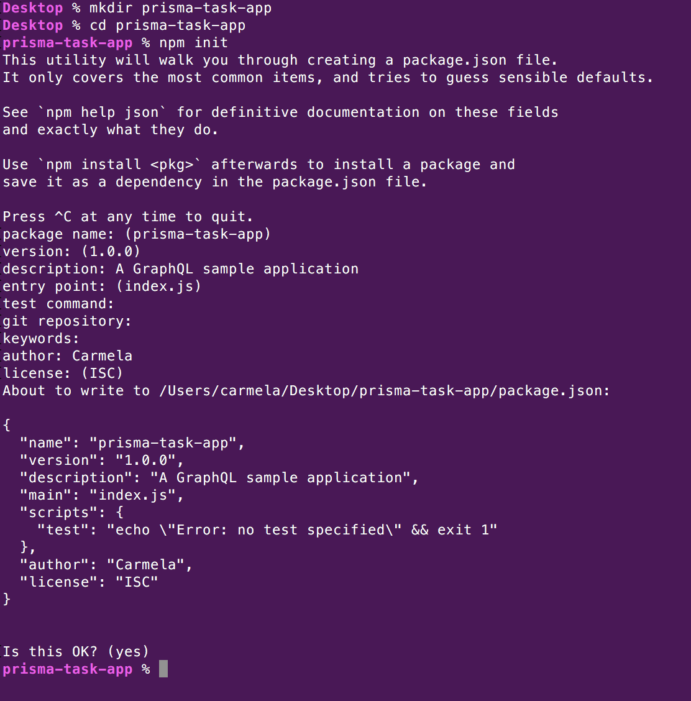
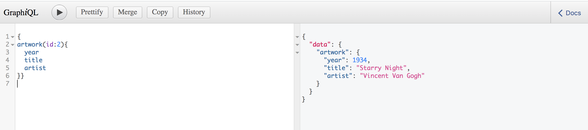
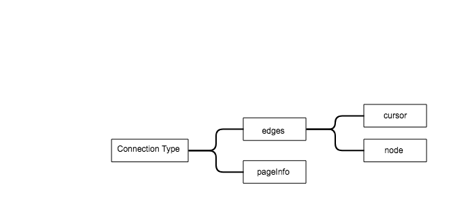

# A cursor-based pagination application created with: Node.js + knex + MySQL + GraphQL

This tutorial will help you to write a sample server-side GraphQL API that uses cursor-based pagination.

*** 

## Introduction to pagination

Nowadays, applications can manage a massive quantity of data. Still, despite the efficient and performant ways to store and manage a big amount of data, one of the main concerns is the way to present them to the final users.

A rational solution to this concern consists of __paginating the data__.
When it comes to a significant amount of data to be returned to the user, __pagination is the standard solution to divide a big dataset into sub-datasets.__
Pagination determines a limit on the number of elements to be shown to the user.
Pagination is a broad concept that applies to many circumstances, such as:

* API (both REST and GraphQL)
* Databases
* Search results coming from a serch engine 
* Messages on a messaging platform

The most common pagination methods are:
- [offset/limit pagination][offset-limit-method]
- [cursor-based pagination][cursor-based-method]

### Offset/limit pagination
This approach is based on the following values:

- __offset:__ it's an integer and defines the position of the starting point to read the data.
- __limit:__ it's an integer and defines the number of data items to fetch after the starting point (the offset)
  
*For example:* let's consider a request to a GraphQL API having the following pagination setting:
__?offset=10&limit=20__

The GraphQL API returns 20 data items after the 10th item.
In the following call parameters offset and limit will change in this way: 
__?offset=30&limit=20__.
The `new offset` is equal to `previous offset (10) + limit value (20)`
The *final page* is reached when the offset value exceeds the total count of data items.

#### Limitations/Advantages of the Offset/Limit pagination

This approach is not the most efficient because of some intrinsic weaknesses.
The approach doesn't scale well for larger and size-variable datasets.
The method's speed is strictly related to the offset-value: *the bigger, the slower*.
When offset is really big the performance goes down because the application should go through all the elements before the offset to throw them away then and start pagination from the *offset-th* item.
Beyond the __performance issues__, there are also problems related to the __correctness of results__. It could happen that some data are received multiple times and some others are never shown. This issue is related to the order of the data and to new data. If the order is not specified and new items are added the __page-drift issue__ is the outcome.
In spite of the limitations, this approach is really simple and is acceptable with a size-limited dataset having approximately a fixed number of items.

### Cursor-based pagination
The __cursor-based pagination (also known as [Relay](https://relay.dev/docs/en/introduction-to-relay)-style pagination)__ is the solution to the limitations of the limit/offset approach.

This method handles data in chunks that start exactly after the item identified by a "cursor" and have a specific size, defined by the "first" parameter.

*For example:* a GraphQL API having a cursor-based pagination consider this kind of setting: 
__?first=5&after="cursorValueString"__ returns the first 5 items after the item having the cursor "cursorValueString".

#### Limitations/Advantages of the Cursor-based pagination
From the __performance point of view__, this approach is efficient and faster. It is not tied neither the offset value nor to the dataset size.
The cursor-based approach doesn't take into consideration the already shown items, as you go ahead paginating the new results. 
It starts paginating from the cursor delimiter, just ignoring everything that stays behind it. 
The biggest limitations of this approach is that it should be based on a value that has a specific order and can be uniquely identified.

***

## Prisma-task-app 
This tutorial shows how to implement a cursor-based pagination on GraphQL API. 
The javascript server-side application runs on __Node.js__ runtime and interacts with a underlying ___MySQL database__ through __Knex__ query builder. You can find the database schema file at `./server/db.sql`

## Prerequisites
1. You should have Node.js javascript runtime installed in your machine. If you don't have it installed, please go to this [link](https://nodejs.org/en/download/) to download it.
2. You should have a MySQL Database installed on your computer. In case you don't have it, please dowload it [here](https://www.mysql.com/it/downloads/)

## General setup
Create the project directory
`mkdir prisma-app-task`

Run the command to inizialize a npm package:
`npm init`

If you want to include package custom information, this is the right time. Just answer to the prompted questions.

If you want to accept the default settings, hit `Enter` and move on.

Create a new sub-directory called `server`
`mkdir server`

Now open your project with your favorite editor, some good options are (Visual Studio Code (was used to create the sample).

Create a new file called `index.js` within the `server` directory.
Add to the javascript file the following function:
```
console.log("My awesome node application is running!");
```

### package.json setup
Open the package.json setup with your favorite editor and add the section  *dependencies*
```
 "dependencies": {
    "express": "^4.17.1",
    "express-graphql": "^0.9.0",
    "graphql": "^14.6.0",
    "knex": "^0.20.9",
    "mysql": "^2.18.1",
    "nodemon": "^1.3.7"
  }
```

Now change the *start script section* to:
```
  "scripts": {
    "start": "./node_modules/.bin/nodemon server/index.js --ignore node_modules/"
  }
```

Go back to your terminal and run the `npm install` command that will install the dependencies.
You can start the application by running:
`nodemon start`

[Nodemon](https://www.npmjs.com/package/nodemon) is a package that allows the auto-refreshing of the application after a change is applied to the code.
Your terminal should now show the message *"My awesome node application is running!"*

The general server setup is all set. Let's go to the database.

## Database setup
To setup your MySQL database, you can either choose to use the command line tool or to download a GUI (__Sequel PRO, phpmyadmin, MySQL Workbench, HeidiSQL__)
You need to create a brand new db called *"art-db"*. 
After that in your project root, create a new sql file and name it *"db.sql"* copy inside this file the db dump that you find in the repository's __db.sql__. 

You need to execute this file to create the __artwork__ table and fill it with data.

If you are using MySQL command line, open a new tab on the terminal and to create the database run:
```
mysql --host=localhost -u{username} -p
CREATE DATABASE art-db;
```
`CTRL` + `C` now exit MySQL CLI.

And to create the tables run:
```
mysql --host=localhost -uroot -p art-db < db.sql
```

If you are using a GUI for your MySQL server, please refer to the manual and create a new DB called "art-db" then execute the SQL file to create the tables and the related content.

### Knex query builder setting
This project uses the *Knex* query builder to interact with the database. Let's go configuring it.
In the project root directory crated the `knexfile.js`.
Add the following lines and replace the username and password fields with your MySQL credentials.

```
module.exports = {
  development: {
    client: 'mysql',
    connection: {
      user: 'YOUR_USERNAME',
      password: 'YOUR_PASSWORD',
      database: 'art-db'
    }
  }
}
```

The query builder now is configured to work on the *art-db* database.

### Basic server implementation
Let's move again to index.js file to start the implementation of the server.
The project is based on *express server* so let's require it at the beginning of the file.
```
var express = require('express');
var app = express();
```

In order to implement GraphQL functionalities you need to require also the *express-graphql* module
```
const expressGraphQL = require('express-graphql')
```

Now define the port you want to use, in this case 4000 and set up the epress app to lisent to this port
```
var port = 4000;
app.listen(port);
console.log("Listening on port", port);  
```

The server is now running and thanks to *nodemon tool* it will be refreshed everytime you change something in the code.

### GraphQL implementation
In order to use GraphQL you need to define a GraphQL schema. This schema contains the __types definition__, a detailed description of the objects that GraphQL will return, and the __query definition__, a detailed description of the requests that GraphQL can handle.

In order to keep the schema definition separated from the server implementation, let's create a new file called __schemaBuild.js__ under the server directory.

At the beginning of the file require *graphql module* and all the GraphQL types that are needed
```
const graphql = require('graphql');

const {
    GraphQLObjectType,
    GraphQLID,
    GraphQLString,
    GraphQLInt,
    GraphQLList,
    GraphQLSchema,
    GraphQLBoolean
} = graphql;
```

Let's start to define the __"ArtworkType"__, this type is related to the table *"artwork"*, indeed it has all the features of an artwork row in the database.
```
const ArtworkType = new GraphQLObjectType({
    name: 'Artwork',
    fields: {
        id: { type: GraphQLID },
        title: { type: GraphQLString },
        year: { type: GraphQLInt },
        artist: { type: GraphQLString }
    }
})
```

And let's define the related query __"artwork"__ within a GRaphQLObject called __"Root Query"__. The query object collects all the possible queries that can be issued.
```
const RootQuery = new GraphQLObjectType({
    description: 'Root Query',
    name: 'Query',
    fields: {
        artwork: {
            type: ArtworkType,
            args: {
                id: { type: GraphQLID }
            },
            description: 'Artwork with a specific ID',
            resolve(parentValue, args) {
                return db.getArtwork(args.id);
            }
        }
})
```

This query object is of type *"ArtworkType"*, that means that it will return an object of *"ArtworkType"* and accepts as an *argument* an integer: the *id* of the artwork.
At the end of the file let's export it:
```
module.exports = new GraphQLSchema({
    query: RootQuery
})
```

In order to keep the database logic separated, everything that involves database operation will be done on the  *db module*, that needs to be imported at the beginning of the SchemaBuild.js file:
```
var db = require('./db');
```

And is defined in a separate file called db.js.


### Database module implementation
Let's create a new file under the server directory and name it __db.js__
This new file used the *knex query builder* to interact with the DB, so let's require and configure it at the beginning of the file.
```
var config = require('../knexfile.js');
var env = 'development';
var knex = require('knex')(config[env]);
```

We want this module to externally expose some database functionalities, such us retrieve an artwork.
To make this happen, every function of this file is exported.

```
module.exports = {
      getArtwork: function (artworkId) {
        return knex('artwork').where('id', artworkId)
            .then(function (row) {
                var normalObj = Object.assign({}, row[0]);
                return normalObj;
            }
            )
            .catch((err) => { console.log(err); throw err })
            .finally(() => {
                //knex.destroy();
            });
    }
}
```

Now the function *getArtwork()* can be called from the *schemaBuild.js* file.

### GraphiQL and schema setup
If you want to see the first results of the application, you need to apply one last change to server settings.
Go back to *index.js* file and require the GraphQL schema at the beginning of the file:
```
var schemaBuild = require('./schemaBuild');
```

And after the port definition add:
```
app.use('/graphql', expressGraphQL({
    schema: schemaBuild,
    graphiql: true
}))
```
GraphiQL is an in-browser GUI to use GraphQL.

Go to [localhost:4000/graphql](http://localhost:4000/graphql) and run the query: 
```
{
artwork(id:2){
  year
  title
  artist
}}
```
You should see this outcome:


### GraphQL Cursor-based pagination 
The [Relay-style pagination specifications]((https://relay.dev/docs/en/introduction-to-relay)-style pagination) define a specific structure to build a cursor-based pagination in GraphQL.
This structure requires the definition of the following specific types:
* Connection Type 
* Edge Type
* PageInfo Type
* Node

__Connection Type__ is made of a list of __Edge Type objects__ and a __PageInfo Type object__.
The __Edge Type__ is made of a list of __node__ and a __cursor__ value.

In this new scenario the *ArtworkType* represents a node of this structure. In GraphQL you can navigate through the edges to all the nodes of the application to discover their values.
The cursor acts like a pointer that indicates the place where starting the exploration and the pageInfo object tells you if there are further nodes to discover or if you are at the end of the edge.

Let's go adding the new types to the schema.
Go to *schemaBuild.js* and right after the *ArtworkType* definition add the following types.
```
const PageInfo = new GraphQLObjectType({
    name: 'PageInfo',
    fields: {
        hasNextPage: { type: GraphQLBoolean },
        lastCursor: { type: GraphQLString }
    }
});

const ArtworkEdge = new GraphQLObjectType({
    name: 'ArtworkEdge',
    fields: {
        node: { type: ArtworkType },
        cursor: { type: GraphQLString },
    }
});

const ArtworkConnection = new GraphQLObjectType({
    name: 'ArtworkConnection',
    fields: {
        edges: { type: new GraphQLList(ArtworkEdge) },
        pageInfo: { type: PageInfo }
    }
});
```

As you can see the new types implements the relationships that we have explained before and that you can see shown in the following picture.



### Implementation of the DB functions to support the pagination
Go back to the *db.js* file ad add to the functions within the *module.export section*, the code:
```
 encode: function (plainId) {
        var encodedId = Buffer.from("cursor_" + plainId).toString('base64');
        return encodedId;
    },
    decode: function (encodedId) {
        var decodedID = Buffer.from(encodedId, 'base64').toString('utf-8').split("_")[1];
        return decodedID;
    }
    allArtworksCursor: function (limitValue, cursor) {
        var cursorVal = cursor;

        return knex('artwork').where('id', '>', cursorVal).limit(limitValue)
            .then(function (rows) {
                const newArtworkMapping = rows.map(item => {
                    var normalObj = Object.assign({}, item);
                    return {
                        cursor: Buffer.from("cursor_" + normalObj.id).toString('base64'),
                        node: {
                            id: normalObj.id,
                            year: normalObj.year,
                            title: normalObj.title,
                            artist: normalObj.artist
                        }
                    }
                });
                return newArtworkMapping;
            });
    },
    allArtworksCursorCount: function (cursor) {
        var cursorVal = cursor;
        return knex('artwork').count('id as nodesLeft').where('id', '>', cursorVal)
            .then(function (res) {
                var normalObj = Object.assign({}, res[0]);
                return normalObj.nodesLeft;
            });
    }
```

All this functions interact using knex with the database and support the pagination implementation in *schemaBuild.js file*, where they are used to paginate artworks. 
Under the *artwork* query definition add a comma `,` and paste the  code:
```
        artworks: {
            type: ArtworkConnection,
            description: "Connection of Artworks",
            args: {
                first: { type: GraphQLInt },
                after: { type: GraphQLString, defaultValue: "Y3Vyc29yXzE=" }
            },
            resolve(parentValue, args) {
                var artworksCollection;
                //This variable should store how many nodes there are in the edge
                var moreResults;
                var cursor = db.decode(args.after);
                artworksCollection = db.allArtworksCursor(args.first, cursor);

                /* This way to decide if more results are available doesn't work"

                var nodesLeft = db.allArtworksCursorCount(cursor);
            
                if (nodesLeft > args.first) {
                    moreResults = true;
                } else {
                    moreResults = false;
                }
                */

                //The right value for hasNextPage should be stored within moreResult and returned by a count function on the db*/
                var newConnection = {
                    pageInfo: {
                        //hasNextPage: moreResults,
                        hasNextPage: true,
                        lastCursor: args.after
                    },
                    edges: artworksCollection
                }
                return newConnection;
            }
        }
```
The pagination is done using an opaque (encode/decode functions are used to get this purpose) string as a cursor (passed as the argument "after"), that identifies uniquely the node and allow to you to query the following "n" element (the value of "n" is passed as the argument "first").

Now you can go back to GraphiQL interface and run the following query:
```
{
artworks(first:5, after:"Y3Vyc29yXzE="){
  edges{
    cursor
    node{
      id
      title
      year
      artist
      
    }
    
  }pageInfo{
    hasNextPage
  }
}
}
```
And this is the result:


You could also ask for the `lastCursor` field, it can be useful for your next query to keep track of the last element you have already seen.

The application is  able to return a specific artwork having an id and a list of paginated artworks that you can go through using cursors.


